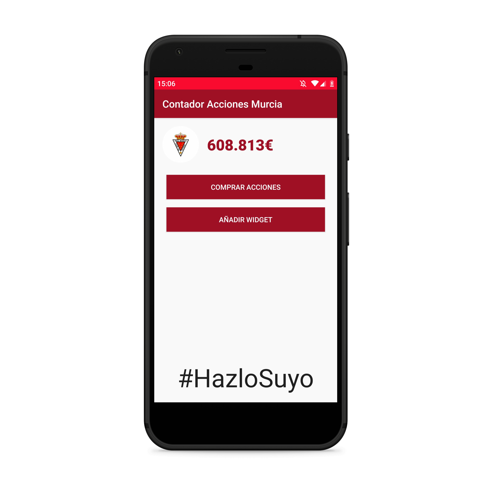

# ⚽🔴⚪  Contador de Acciones Real Murcia

# Contexto

En Mayo de 2020 el club histórico Real Murcia CF estaba inmerso en una ampliación de capital para garantizar la supervivencia del club, que acumulaba muchos problemas.

Para ello, se lanzó la campaña #HazloSuyo con el objetivo de conseguir más accionistas minoritarios y dar viabilidad al club.

Ante la gran cantidad de nuevos accionistas y la euforía contagiada entre los aficionados, desarrolle está app que te permitia tener en tu movil el dato de acciones compradas en tiempo real.

# Widget

Tambien es posible instalartelo como Widget para tenerlo siempre en tu pantalla principal.

# Funcionamiento

La app hace un pequeño WebScrapping a la web oficial de la campaña del Real Murcia, haciendo uso de expresiones regulares para obtener el dato exacto.

# Descargar app

# Créditos

- [Web oficial Real Murcia](https://realmurcia.es/hazlosuyo/index.php)

